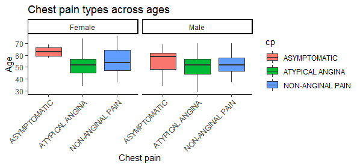
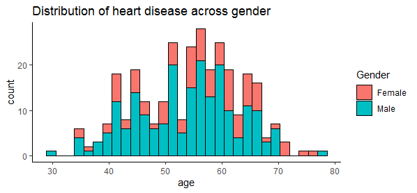
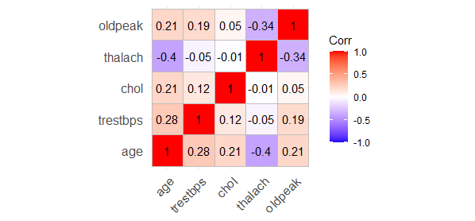
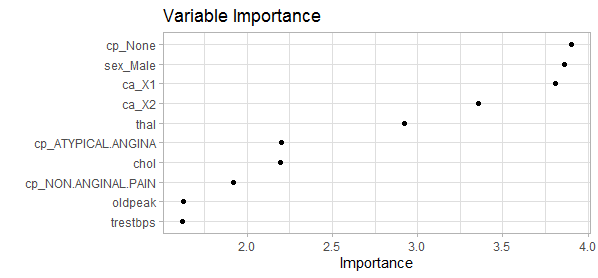

# Heart-Disease-Prediction

## Project Overview

This datset contains 76 attributes, but all published experiments refer to using a subset of 14 of them. In particular, the database is the only one that has been used by ML researchers to this date. The "goal" field refers to the presecnce of heart disease in the patient.

The goal is to predict whether one has heart disease or not.

## Data cleaning

There were no missing variables for this dataset

## EDA

Here are some of the highlights of the visualizations i made.

## Model Building

I built two models(linear regression and random forest). The linear regression model performed better with the following metrics:

  * Accuracy - 0.773
  
  *Roc_auc - 0.874
  
  
